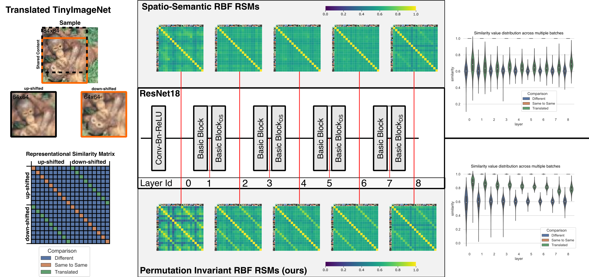

## Decoupling spatial alignment from semantic similarity for neural network

This is the repository holding the code to calculate permutation invariant similarity between image representations from the paper "Decoupling spatial alignment from semantic similarity for neural network".

### Summary
When comparing representations between two samples, it is currently essential for semantically similar features to align spatially. Even a small translational shift can result in a low perceived similarity, despite the overall image content and representations being largely similar when accounting for the shift. This creates a reliance on the coincidental spatial alignment of objects in the respective images, which we argue is an unnecessary and limiting requirement.

To overcome this, we propose introducing permutation invariance to the representations of vision models. This is achieved by identifying the optimal permutation of the representations between the two samples. Specifically, we permute the _concept vectors_—interpreting the channels as semantic dimensions, with each spatial position (width and height) having its own _concept vector_. Afterward, we permute the spatial positions while keeping the channel dimensions unchanged, optimizing for the permutation that maximizes the inner product between the two representations. The provided code includes the implementation of both the optimal permutation and approximative permutation methods.

### Installation
Installation is straight forward, just clone the repository and install it via pip.
```bash
git clone git@github.com:TaWald/semantic_rsm.git
cd semantic_rsm
conda activate <your_env>  # optional but recommended
pip install -e .
```

### Usage
There are various entrypoints to run the code, which can be differentiated into:
1. Calculating RSMs for multiple layers of representations
2. Calculating RSMs for a single layer
3. Calculating the similarity between two samples.

#### 1. Calculating RSMs for multiple layers of representations
To calculate the RSMs for multiple layers of representations, you can use the functions `get_or_calculate_RSM` and `get_or_calculate_baseline_RSM` from `entrypoint.py`.
The `baseline` version calculates spatio-semantic RSMs while the other calculates the RSMs in permutation-invariant fashion.
Check the docstring of the function for detailled information.

Representationa are expected to be in shape of `(n, c, h, w)` or `(n, t, d)` and already preprocessed.


#### 2. Calculating RSMs for a single layer
To calculate the RSMs for a single layer, you can use the functions `semantic_sim_parallel` and `similarity_calculation` from `core/sim_calc.py`. Similarly to the previous entrypoint, the `semantic_sim_parallel` function calculates the RSMs in permutation-invariant fashion while the other calculates the spatio-semantic RSMs. Representations are expected to be `[N, C, H*W]` or `[N, D, T]`. Check the docstring for more details.

#### 3. Calculating the similarity between two samples
To calculate the permutation or perm-inv similarity between two samples, you can use the function `perm_inv_semantic_sim` from `core/sim_calc.py`. The function expects two representations of shape `[H*W, C]` or `[T, D]` and returns the similarity between the two samples and optionally the permutation that was found. Check the docstring for more details.

Using this function is not advides though, as e.g. the RBF kernel requires a full batch for the selection of sigma (in our code it's the median of the pairwise distances). For the inner-product or cosine similarity it could be used though. 


#### Questions
If you have any questions, feel free to open an issue or contact me directly via `tassilo.wald (at) dkfz-heidelberg.de`


### Paper
Our paper is accepted to NeurIPS24, check out the associated pre-print on [ArXiv](https://arxiv.org/pdf/2410.23107) and if you use the code, please
cite the paper
```bibtex
@article{wald2024decoupling,
  title={Decoupling Semantic Similarity from Spatial Alignment for Neural Networks},
  author={Wald, Tassilo and Ulrich, Constantin and K{\"o}hler, Gregor and Zimmerer, David and Denner, Stefan and Baumgartner, Michael and Isensee, Fabian and Jaini, Priyank and Maier-Hein, Klaus H},
  journal={arXiv preprint arXiv:2410.23107},
  year={2024}
}
```